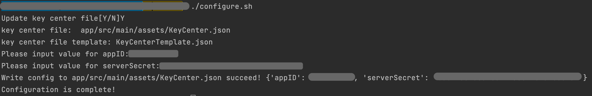
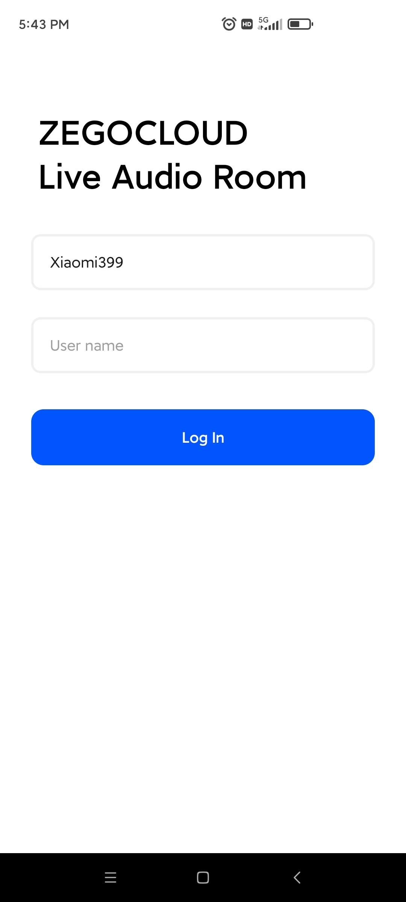

# ZEGOCLOUD Live Audio Room

ZEGOCLOUD's Live Audio Room solution is a one-stop solution for building full-featured live audio rooms into your apps, including interactive live audio streaming, instant messaging, room management, and in-room controls.

In live audio rooms, users can host, listen in, and join live audio conversations. Users can also interact with each other via text chat, virtual gifting, "bullet screen" messages, and other features. In a single room, there can be up to 50 speakers at the same time and an unlimited number of listeners.

With ZEGOCLOUD's Live Audio Room, you can build different types of live audio apps, such as online werewolf (a voice-based social deduction game), online karaoke, and more.

## Getting started 

Before getting started with the Live Audio Room application, **contact us to activate the Live Audio Room (RTC + IM) service first**, and then do the following:

### Prerequisites

* [Android Studio 2020.3.1 or later\|_blank](https://developer.android.com/studio)
* Android SDK Packages: Android SDK 30, Android SDK Platform-Tools 30.x.x or later.
* An Android device or Simulator that is running on Android 4.1 or later and supports audio and video. We recommend you use a real device (Remember to enable **USB debugging** for the device).
* Create a project in [ZEGO Admin Console\|_blank](https://console.zego.im/). For details, see [ZEGO Admin Console - Project management\|_blank](https://doc-en.zego.im/article/1271).

### Modify the project configurations

1. Clone the Live Audio Room Github repository.
2. Open Terminal, navigate to the cloned project repository.
3. Run the configuration script with the `./configure.sh` command. And fill in the AppID, AppSign, and ServerSecret, which can be obtained in the [ZEGO Admin Console\|_blank](https://console.zego.im/).  
**Note**: If you are using Windows system, double-click the `configure.bat` to run the configuration script. 

### Run the sample code

1. Open the Live Audio Room project in Android Studio.
2. Make sure the developer mode and USB debugging are enabled for the Android device, and connect the Android device to your computer.
3. If the **Running Devices** box in the upper area changes to the device name you are using, which means you are ready to run the sample code.  
4. Run the sample code on your device to experience the Live Audio Room service.  

## More documentation
You can find more documentation on our official website: [Live Audio Room (RTC+ IM)](https://doc-en.zego.im/article/13746).

